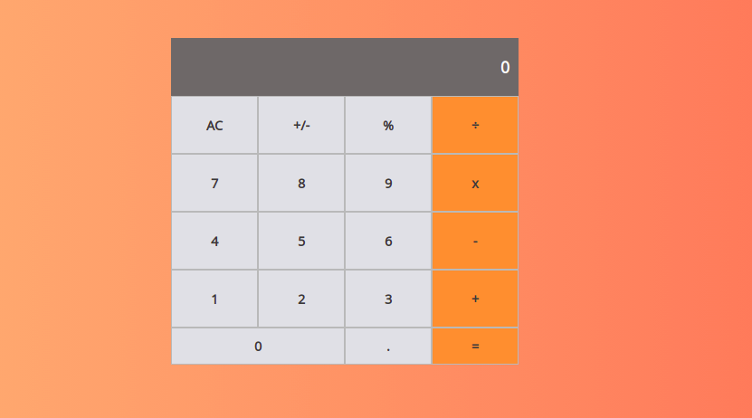

# Project Name

Math Magicians



# Project Description

> This is the first project of the Math Magicians application. I set up the environment and tools needed to develop a React application. In the project, I will develop the actual application.

## Built With

- Major languages
    - JavaScript
    - HTML & CSS
- Frameworks
    - React
- Text editor
    - VSCode


## Getting Started


To get a local copy up and running follow these simple example steps.

### Prerequisites

- Have NodeJS installed
- Have Git Bash installed
- Have a code editor

### Setup

- Get this repository on your computer using ```git clone git@github.com:Gbengacode/react-math-magician.git``` on any folder
- Open the created folder on your code editor

### Install

- Run ```npm install``` using your integrated console

### Usage

- You can launch the React app using ```npm start``` on your integrated console

## Author

👤 **Emmanuel Gbenga**

- GitHub: [@gbengacode](https://github.com/gbengacode)

## 🤝 Contributing

Contributions, issues, and feature requests are welcome!

## Show your support

Give a ⭐️ if you like this project!

## Acknowledgments

- Hat tip to anyone whose code was used
- Inspiration
- etc

